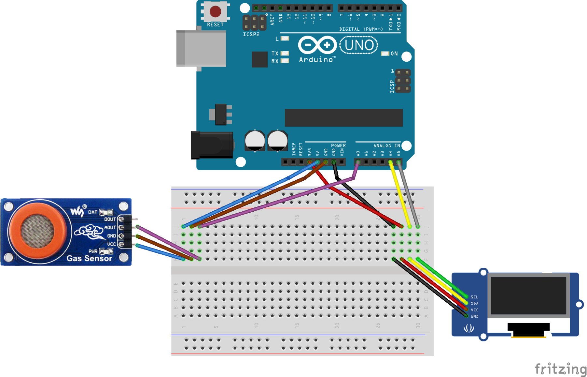
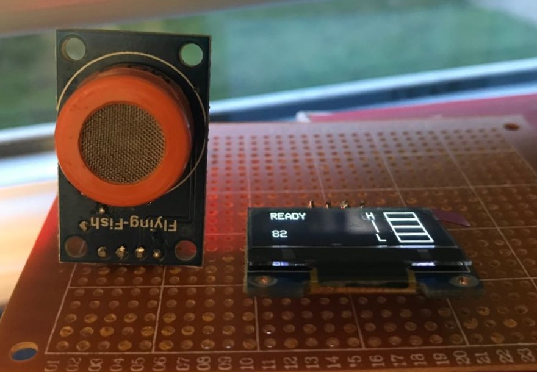
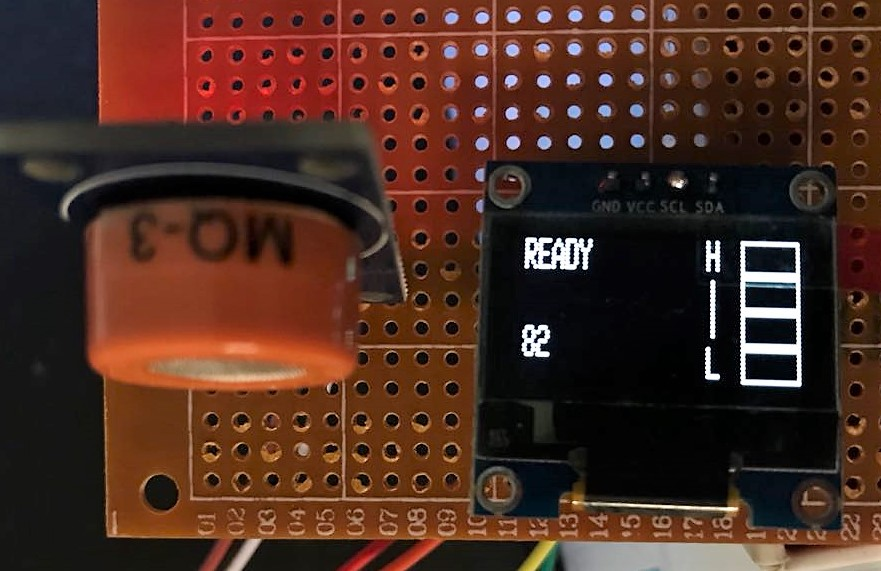
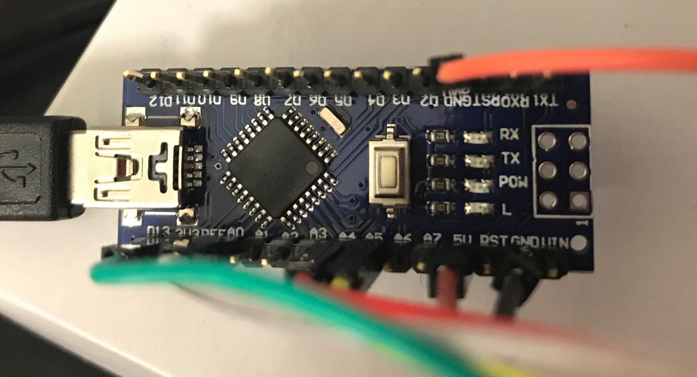

# Alcoduino
A MQ-3 sensor Arduino breathalyser.

## Parts required

* Any Arduino-based board (Arduino UNO used)
* MQ-3 gas sensor
* Adafruit SSD1366 128*32 OLED display

## Diagram

## Images in action

|Sensor view             |  Display view		|	Warming up 			|
|:----------------------:|:--------------------:|:---------------------:|
|      |    |	  |

| Board view             	 |
|:--------------------------:|
| 		 |